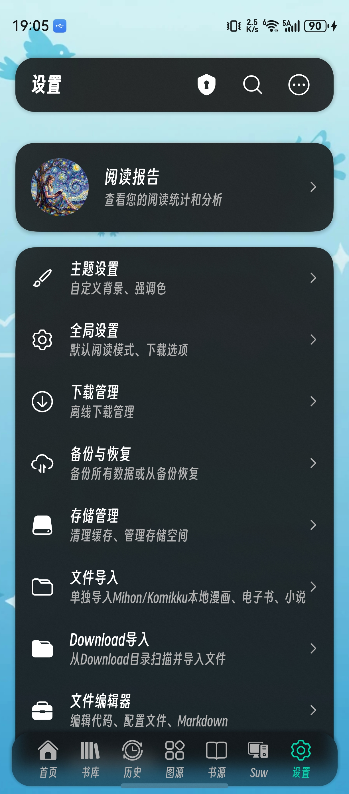
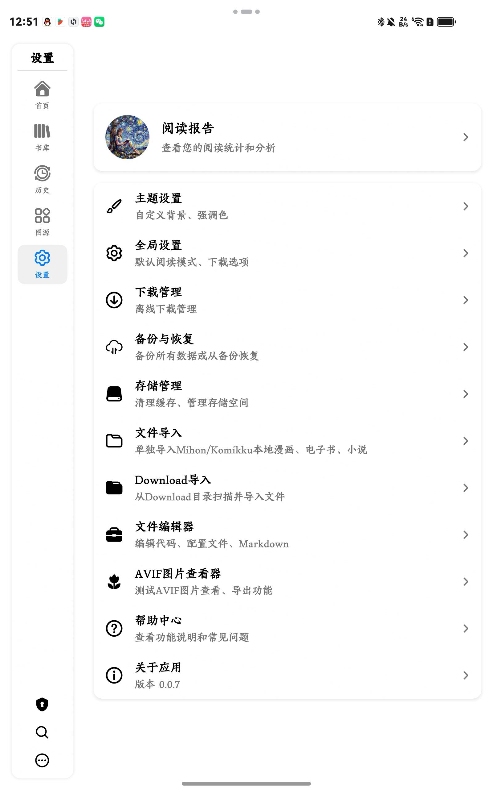

# 漫匣 (ManXia)

<div align="center">

**一款基于 HarmonyOS Next 的现代化漫画与小说阅读应用**

[](https://developer.huawei.com/consumer/cn/harmonyos/)
[](https://developer.huawei.com/consumer/cn/doc/harmonyos-guides/arkts-get-started-0000001504769321)
[](LICENSE)

</div>

## 📱 应用截图

<div align="center">
<table>
  <tr>
    <td></td>
    <td></td>
    <td></td>
    <td></td>
    <td></td>
    <td></td>
    <td></td>
  </tr>
  <tr>
    <td align="center">首页</td>
    <td align="center">发现</td>
    <td align="center">漫画详情</td>
    <td align="center">图源</td>
    <td align="center">开源阅读书源</td>
    <td align="center">设置</td>
    <td align="center">平板设置</td>
  </tr>
</table>
</div>


## 📖 项目简介

漫匣是一款专为 HarmonyOS Next 平台开发的综合阅读应用，支持**漫画**、**电子书**和**小说**三大内容类型。基于 ArkTS 与 C ，提供流畅的阅读体验和丰富的功能特性。

### ✨ 核心特性

- 🎨 **现代化UI设计** - 遵循 HarmonyOS 设计规范，支持深色/浅色主题自动切换
- 📚 **多图源支持** - 支持 WebView 和 API 两种图源类型，可扩展的图源系统
- 📖 **网络小说** - 兼容 Legado 书源格式，支持数千书源导入，海量小说资源
- 🔍 **全局搜索** - 支持跨图源/书源搜索，快速定位想看的内容
- 📖 **优秀的阅读体验** - 漫画支持单页/双页/条漫模式，小说支持自定义排版规则与净化规则
- 💾 **本地管理** - 支持本地漫画导入，电子书阅读（EPUB/PDF/TXT/MOBI/AZW3）与小说导入
- 🔐 **源站登录** - 支持图源账号登录，访问个人收藏和历史记录
- 🎯 **图片处理** - 支持特殊图源的图片解扰算法（如禁漫天堂）
- 🌐 **离线阅读** - 支持漫画/小说下载缓存，随时随地阅读
- 📊 **阅读统计** - 详细的阅读时长、进度统计和分析，并且支持阅读目标小组件

### 🏗️ 技术架构

- **开发语言**: ArkTS + C++ (HarmonyOS Next API 18)
- **架构模式**: ECS (Entity-Component-System)
- **UI框架**: ArkUI
- **数据存储**: 关系型数据库 (RDB)
- **网络请求**: HTTP Client + WebView
- **图片处理**: Image Kit + 自定义解扰算法
- **JS引擎**: JSVM (用于书源规则执行)
- **HTML解析**: 自定义 HTML Parser (支持 CSS/XPath/JSONPath 选择器)

## 🚀 快速开始(由于本项目仍处于早期开发阶段，暂不建议作为学习对象)

### 环境要求

- DevEco Studio 5.0.0 或更高版本
- HarmonyOS Next SDK (API 18)
- Node.js 16.0.0 或更高版本

### 安装步骤

1. 克隆项目
```bash
git clone https://github.com/DaLongZhuaZi/manxia.git
cd manxia
```

2. 打开项目
- 使用 DevEco Studio 打开项目
- 配置证书，编译项目

3. 运行项目
- 连接 HarmonyOS Next 设备或启动模拟器
- 点击运行按钮

## 📂 项目结构

```
manxia/
├── AppScope/                       # 应用全局配置
│   ├── app.json5                   # 应用配置文件
│   └── resources/                  # 全局资源
├── entry/                          # 主模块
│   └── src/main/
│       ├── ets/                    # ArkTS 源代码
│       │   ├── entryability/       # 应用入口能力
│       │   │   └── EntryAbility.ets
│       │   ├── Framework/          # 核心框架层
│       │   │   ├── Adapters/       # 适配器层
│       │   │   ├── Animation/      # 动画系统
│       │   │   ├── Authentication/ # 认证系统
│       │   │   ├── Cache/          # 缓存管理
│       │   │   │   ├── CoverCacheManager.ets        # 封面缓存
│       │   │   │   ├── ImageCacheManager.ets        # 图片缓存
│       │   │   │   ├── OnlineImageLoader.ets        # 在线图片加载
│       │   │   │   ├── PermanentImageCacheManager.ets # 永久缓存
│       │   │   │   └── WebViewDataCacheManager.ets  # WebView数据缓存
│       │   │   ├── Components/     # 通用UI组件
│       │   │   │   ├── ConsolePanel.ets             # 控制台面板
│       │   │   │   ├── CoverSelectionDialog.ets     # 封面选择对话框
│       │   │   │   ├── EBookMetadataDialog.ets      # 电子书元数据对话框
│       │   │   │   ├── EBookReadingSettingsPanel.ets # 电子书阅读设置
│       │   │   │   ├── GlobalBackgroundLayer.ets    # 全局背景层
│       │   │   │   ├── GuideOverlay.ets             # 引导遮罩
│       │   │   │   ├── PdfViewerComponent.ets       # PDF查看器
│       │   │   │   ├── PerformanceChart.ets         # 性能图表
│       │   │   │   ├── ReaderKitViewerComponent.ets # 阅读器组件
│       │   │   │   ├── ThemeAware.ets               # 主题感知
│       │   │   │   ├── ThemeToggle.ets              # 主题切换
│       │   │   │   └── UniversalDialog.ets          # 通用对话框
│       │   │   ├── Compress/       # 压缩/解压系统
│       │   │   │   └── ComicArchiveManager.ets      # 漫画压缩包管理
│       │   │   ├── Core/           # 核心功能
│       │   │   │   └── ErrorHandler.ets             # 错误处理
│       │   │   ├── Data/           # 数据管理层
│       │   │   │   ├── DataManager.ets              # 数据管理器
│       │   │   │   └── EBookDataManager.ets         # 电子书数据管理
│       │   │   ├── Database/       # 数据库层
│       │   │   │   ├── DatabaseManager.ets          # 数据库管理器
│       │   │   │   ├── DatabaseSchema.ets           # 数据库架构
│       │   │   │   ├── DatabaseTypes.ets            # 数据库类型定义
│       │   │   │   └── MigrationScripts.ets         # 数据迁移脚本
│       │   │   ├── Debug/          # 调试工具
│       │   │   │   ├── ConsolePanel.ets             # 调试控制台
│       │   │   │   ├── HidebugPerformanceCollector.ets # 性能收集
│       │   │   │   ├── LogCollector.ets             # 日志收集
│       │   │   │   └── PerformanceAnalyzer.ets      # 性能分析
│       │   │   ├── Diagnostics/    # 诊断系统
│       │   │   │   ├── StartupController.ets        # 启动控制器
│       │   │   │   ├── StartupDiagnostics.ets       # 启动诊断
│       │   │   │   ├── StartupRecovery.ets          # 启动恢复
│       │   │   │   └── StartupTest.ets              # 启动测试
│       │   │   ├── Download/       # 下载管理
│       │   │   │   └── DownloadManager.ets          # 下载管理器
│       │   │   ├── ImageProcessing/# 图片处理系统
│       │   │   │   └── ImageDescramblerInitializer.ets # 图片解扰初始化
│       │   │   ├── Initialization/ # 初始化系统
│       │   │   │   └── DataInitializer.ets          # 数据初始化
│       │   │   ├── Loading/        # 加载状态管理
│       │   │   │   └── LoadingStateManager.ets      # 加载状态管理器
│       │   │   ├── Managers/       # 系统管理器
│       │   │   │   ├── AppInfoManager.ets           # 应用信息管理
│       │   │   │   ├── Component.ets                # 组件管理
│       │   │   │   ├── CookieManager.ets            # Cookie管理
│       │   │   │   ├── DeviceAdaptationManager.ets  # 设备适配管理
│       │   │   │   ├── MangaDataLoader.ets          # 漫画数据加载
│       │   │   │   ├── NotificationManager.ets      # 通知管理
│       │   │   │   ├── SearchHistoryManager.ets     # 搜索历史管理
│       │   │   │   └── SettingsManager.ets          # 设置管理
│       │   │   ├── Parsers/        # 解析器
│       │   │   │   ├── EBookParser.ets              # 电子书解析器
│       │   │   │   ├── EpubParser.ets               # EPUB解析器
│       │   │   │   ├── PdfParser.ets                # PDF解析器
│       │   │   │   └── TxtParser.ets                # TXT解析器
│       │   │   ├── Novel/          # 小说模块
│       │   │   │   ├── NovelDataManager.ets         # 小说数据管理
│       │   │   │   ├── NovelSourceManager.ets       # 书源管理
│       │   │   │   ├── NovelSourceExecutor.ets      # 书源执行器
│       │   │   │   ├── NovelSourceValidator.ets     # 书源校验器
│       │   │   │   ├── NovelChapterCacheManager.ets # 章节缓存
│       │   │   │   ├── NovelContentProcessor.ets    # 内容处理器
│       │   │   │   ├── NovelReplaceRuleManager.ets  # 替换规则
│       │   │   │   ├── NovelTxtTocRuleManager.ets   # TXT目录规则
│       │   │   │   ├── LegadoSourceParser.ets       # Legado书源解析
│       │   │   │   ├── LegadoRuleAnalyzer.ets       # 规则分析器
│       │   │   │   ├── LegadoUrlAnalyzer.ets        # URL分析器
│       │   │   │   ├── LegadoJsEngine.ets           # JS引擎
│       │   │   │   └── index.ets                    # 模块导出
│       │   │   ├── Plugin/         # 插件系统
│       │   │   ├── Services/       # 服务层
│       │   │   ├── Source/         # 图源系统
│       │   │   ├── Storage/        # 存储管理
│       │   │   ├── Types/          # 类型定义
│       │   │   │   └── StatusEnums.ets              # 状态枚举
│       │   │   ├── Utils/          # 框架工具类
│       │   │   │   ├── DataValidator.ets            # 数据验证
│       │   │   │   └── ResponsiveLayout.ets         # 响应式布局
│       │   │   ├── WebView/        # WebView 图源引擎
│       │   │   │   ├── ConfigurationParser.ets      # 配置解析器
│       │   │   │   ├── MangaSourceActionEngine.ets  # 图源动作引擎
│       │   │   │   ├── MangaSourceAPIEngine.ets     # 图源API引擎
│       │   │   │   ├── WebViewImageLoader.ets       # WebView图片加载
│       │   │   │   └── doc/                         # WebView文档
│       │   │   ├── Workflow/       # 工作流系统
│       │   │   ├── DependencyContainer.ets          # 依赖注入容器
│       │   │   └── EventBus.ets                     # 事件总线
│       │   ├── libs/               # 第三方库
│       │   │   └── htmlparser/     # HTML解析库
│       │   │       ├── HTMLElement.ets              # HTML元素
│       │   │       ├── Parser.ets                   # 解析器
│       │   │       ├── LegadoHtmlBridge.ets         # Legado桥接
│       │   │       └── index.ets                    # 模块导出
│       │   ├── pages/              # 页面组件
│       │   │   ├── AboutPage.ets                    # 关于页面
│       │   │   ├── CoverSelectionPage.ets           # 封面选择页面
│       │   │   ├── DataManagementPage.ets           # 数据管理页面
│       │   │   ├── DownloadManagerPage.ets          # 下载管理页面
│       │   │   ├── EBookDetailPage.ets              # 电子书详情页
│       │   │   ├── EBookReaderPage.ets              # 电子书阅读页
│       │   │   ├── GlobalSearchPage.ets             # 全局搜索页面
│       │   │   ├── GlobalSettingsPage.ets           # 全局设置页面
│       │   │   ├── LogManagerPage.ets               # 日志管理页面
│       │   │   ├── MainMenuPage.ets                 # 主菜单页面
│       │   │   ├── MangaDetailPage.ets              # 漫画详情页
│       │   │   ├── MangaFeedbackPage.ets            # 漫画反馈页面
│       │   │   ├── MangaReaderPage.ets              # 漫画阅读页
│       │   │   ├── MangaSettingsPage.ets            # 漫画设置页面
│       │   │   ├── MangaSourceTestPage.ets          # 图源测试页面
│       │   │   ├── NovelBookshelfPage.ets           # 小说书架页
│       │   │   ├── NovelSearchPage.ets              # 小说搜索页
│       │   │   ├── NovelDetailPage.ets              # 小说详情页
│       │   │   ├── NovelReaderPage.ets              # 小说阅读页
│       │   │   ├── NovelExplorePage.ets             # 小说发现页
│       │   │   ├── NovelSourceManagementPage.ets    # 书源管理页
│       │   │   ├── NovelSourceDebugPage.ets         # 书源调试页
│       │   │   ├── NovelSettingsPage.ets            # 小说设置页
│       │   │   ├── NovelReplaceRulePage.ets         # 替换规则页
│       │   │   ├── NovelTxtTocRulePage.ets          # TXT目录规则页
│       │   │   ├── ReadingAnalyticsPage.ets         # 阅读分析页面
│       │   │   ├── SearchPage.ets                   # 搜索页面（旧）
│       │   │   ├── SourceDetailPage.ets             # 图源详情页
│       │   │   ├── SourceGuidePage.ets              # 图源引导页
│       │   │   ├── SourceLoginPage.ets              # 图源登录页
│       │   │   ├── SourceManagementPage.ets         # 图源管理页面
│       │   │   ├── SourceSettingsPage.ets           # 图源设置页面
│       │   │   ├── SpecialEventPage.ets             # 特殊事件页面
│       │   │   ├── SplashPage.ets                   # 启动页
│       │   │   ├── StorageManagementPage.ets        # 存储管理页面
│       │   │   ├── SystemAnimationDemoPage.ets      # 系统动画演示
│       │   │   ├── SystemResourceDemoPage.ets       # 系统资源演示
│       │   │   ├── SystemStatusPage.ets             # 系统状态页面
│       │   │   ├── TestManagementPage.ets           # 测试管理页面
│       │   │   ├── ThemeSettingsPage.ets            # 主题设置页面
│       │   │   ├── WebViewConfigurableSystemTestPage.ets # WebView配置测试
│       │   │   ├── WelcomeGuidePage.ets             # 欢迎引导页
│       │   │   └── helpers/                         # 页面辅助工具
│       │   ├── components/         # 业务组件
│       │   │   ├── MangaInteractionOverlay.ets      # 漫画交互遮罩
│       │   │   ├── MangaQuickSettings.ets           # 漫画快速设置
│       │   │   ├── MangaReaderChapterList.ets       # 章节列表
│       │   │   ├── MangaReaderSettings.ets          # 阅读器设置
│       │   │   └── MangaViewer.ets                  # 漫画查看器
│       │   ├── Models/             # 数据模型
│       │   │   ├── EBookModels.ets                  # 电子书模型
│       │   │   ├── MangaModels.ets                  # 漫画模型
│       │   │   ├── NovelModels.ets                  # 小说模型
│       │   │   └── TempMangaModels.ets              # 临时漫画模型
│       │   ├── Utils/              # 工具类
│       │   │   ├── AvifTranscoder.ets               # AVIF转码器（未实现）
│       │   │   ├── ComicInfoParser.ets              # 漫画信息解析
│       │   │   ├── CompressionUtils.ets             # 压缩工具
│       │   │   ├── DeviceInfo.ets                   # 设备信息
│       │   │   ├── LogFloatingWindow.ets            # 日志浮窗
│       │   │   ├── Logger.ets                       # 日志工具
│       │   │   ├── NativeModuleManager.ets          # 原生模块管理
│       │   │   └── WindowManager.ets                # 窗口管理
│       │   ├── Data/               # 测试数据
│       │   │   ├── ResourceMap.ets                  # 资源映射
│       │   │   ├── SampleMangaData.ets              # 示例漫画数据
│       │   │   └── TestData.ets                     # 测试数据
│       │   ├── ShareExtAbility/    # 分享扩展能力
│       │   ├── GlobalContext.ets   # 全局上下文
│       │   └── MyAbilityStage.ets  # 应用生命周期
│       ├── cpp/                    # C++ Native代码
│       │   ├── CMakeLists.txt                       # CMake配置
│       │   ├── jsvm_engine.cpp                      # JSVM引擎实现
│       │   ├── webdav/                              # WebDAV/FTP Native模块
│       │   │   ├── CMakeLists.txt                   # WebDAV模块CMake配置
│       │   │   ├── webdav_client.cpp/h              # WebDAV客户端实现
│       │   │   ├── webdav_napi.cpp                  # WebDAV NAPI接口
│       │   │   ├── ftp_client.cpp/h                 # FTP客户端实现
│       │   │   ├── ftp_napi.cpp                     # FTP NAPI接口
│       │   │   └── include/                         # libcurl头文件
│       │   └── types/                               # 类型定义
│       │       ├── libjsvm_engine/                  # JSVM引擎类型
│       │       └── libwebdav_native/                # WebDAV/FTP类型定义
│       ├── libs/                   # 预编译Native库
│       │   └── arm64-v8a/                           # ARM64架构库
│       │       ├── libcurl.so                       # libcurl (HTTP/FTP)
│       │       ├── libmbedtls.so                    # mbedTLS (SSL/TLS)
│       │       ├── libmbedcrypto.so                 # mbedTLS加密库
│       │       └── libmbedx509.so                   # mbedTLS X509库
│       ├── resources/              # 资源文件
│       │   ├── base/               # 基础资源
│       │   ├── dark/               # 深色主题资源
│       │   └── rawfile/            # 原始文件
│       └── module.json5            # 模块配置文件
├── sources/                        # 图源配置文件
│   ├── copymanga_api.json          # 拷贝漫画 API配置
│   ├── copymanga_webview.json      # 拷贝漫画 WebView配置
│   ├── jinmantiantang_webview.json # 禁漫天堂 webview配置
│   ├── komiic_api.json             # Komiic API配置
│   ├── komiic_webview.json         # Komiic WebView配置
│   ├── source-schema.json          # 图源配置架构
│   └── *.md                        # 图源开发文档
├── docs/                           # 文档目录
│   ├── development/                # 开发文档
│   ├── analysis/                   # 分析报告
│   ├── architecture/               # 架构文档
│   ├── guides/                     # 使用指南
│   ├── tools/                      # 工具文档
│   ├── troubleshooting/            # 故障排除
│   ├── ui/                         # UI设计文档
│   └── webview/                    # WebView相关文档
├── keiyoushi-extensions-source/    # Keiyoushi 扩展源参考
├── copymanga-copy20/               # 拷贝漫画源参考
├── manxia-extensions-source/       # 漫匣自定义扩展源
├── hvigor/                         # 构建工具配置
├── build-profile.json5             # 构建配置
├── hvigorfile.ts                   # 构建脚本
└── oh-package.json5                # 依赖包配置

```

## 🎯 主要功能

### 1. 漫画图源系统

支持两种图源类型：

#### WebView 图源
- 基于 WebView 的网页抓取
- 支持复杂的网页交互和 JavaScript 执行
- 配置文件驱动，易于扩展
- 示例：禁漫天堂、漫画1234

#### API 图源
- 基于 HTTP API 的数据获取
- 性能更好，响应更快
- 支持复杂的认证和加密
- 示例：哔咔漫画、拷贝漫画

### 2. 小说书源系统

兼容 **Legado（阅读）** 书源格式，支持数千书源导入：

- **书源解析**: 完整支持 Legado 书源 JSON 格式
- **规则引擎**: 支持 CSS选择器、XPath、JSONPath、正则表达式
- **JS执行**: 内置 JSVM 引擎，支持书源中的 JavaScript 代码
- **书源校验**: 批量校验书源可用性
- **替换规则**: 支持目录识别、净化与替换规则
- **章节缓存**: 智能缓存已读章节

### 3. 图片处理

- **图片解扰**: 支持禁漫天堂等特殊图源的图片解扰算法
- **图片缓存**: 智能缓存机制，减少重复网络请求
- **图片预加载**: 提前加载下一页/章节，流畅阅读体验
- **懒加载**: 优化内存使用，支持大量图片

### 4. 漫画阅读器

- **单页模式**: 传统的翻页阅读
- **双页模式**: 横向展示，模拟实体书的阅读效果
- **条漫模式**: 适合WEBTOON漫画类型
- **缩放功能**: 双击放大，捏合缩放
- **进度保存**: 自动记录阅读进度

### 5. 小说阅读器

- **自定义排版**: 字体、字号、行距、边距等全面可调
- **背景主题**: 多种预设背景色，并且支持自定义图片背景
- **翻页方式**: 支持点击、滑动、音量键翻页
- **自动翻页**: 可设置自动翻页速度
- **章节导航**: 快速跳转章节
- **自定义字体**: 可导入本地字体文件 

### 6. 本地管理

- **漫画导入**: 支持 ZIP/CBZ/TAR/GZ/7Z 等压缩格式
- **电子书阅读**: 支持 EPUB/PDF/TXT/MOBI/AZW3 格式
- **书库管理**: 分类、排序、搜索、标签
- **阅读历史**: 记录阅读轨迹
- **阅读统计**: 详细的阅读时长和进度分析

## 🔧 配置说明

### 图源配置

图源配置文件位于 `manxia-extensions-source/` 目录，采用 JSON 格式：

```json
{
  "metadata": {
    "id": "source_id",
    "name": "图源名称",
    "version": "1.0.0",
    "baseUrl": "https://example.com"
  },
  "capabilities": {
    "urlResolver": true,
    "pagination": true,
    "imageDecoding": false
  },
  "workflows": {
    "popular": { /* 热门漫画工作流 */ },
    "search": { /* 搜索工作流 */ },
    "getMangaDetail": { /* 获取详情工作流 */ }
  }
}
```

详细配置说明请参考 [图源配置文档](docs/development/)

## 📚 开源致谢

本项目在开发过程中参考和使用了以下开源项目的代码和思路，特此致谢：

### 核心参考项目

#### 1. Keiyoushi Extensions
- **项目地址**: https://github.com/keiyoushi/extensions
- **使用内容**: 图源扩展架构设计、部分图源实现参考
- **许可证**: Apache License 2.0
- **说明**: Keiyoushi 是 Tachiyomi 的社区维护版本，提供了大量的漫画图源扩展。本项目参考了其扩展架构设计和部分图源的实现逻辑，并根据 HarmonyOS 平台的WebView特性进行了重新实现。

#### 2. CopyManga Copy20
- **项目地址**: https://github.com/LittleSurvival/copymanga-copy20/
- **使用内容**: 拷贝漫画图源的 API 接口分析和实现参考
- **许可证**: 未明确声明（该项目基于 stevenyomi/copymanga 的延伸版本）
- **说明**: 该项目是 stevenyomi/copymanga 的社区维护版本，提供了拷贝漫画的 API 接口文档和实现示例。本项目参考了其 API 调用方式和数据结构设计，并根据 HarmonyOS 平台特性进行了重新实现。

#### 3. Legado (阅读)
- **项目地址**: https://github.com/gedoor/legado
- **使用内容**: 书源格式规范、规则解析引擎设计参考
- **许可证**: GPL-3.0 License
- **说明**: Legado 是一款优秀的开源阅读应用，本项目的小说模块完全兼容其书源 JSON 格式，支持导入数千个社区书源。本项目参考了其规则解析引擎的设计思路（包括 CSS 选择器、XPath、JSONPath、正则表达式等），并使用 ArkTS 和 JSVM 进行了完全重写。

### 技术栈

- **HarmonyOS Next SDK** - 华为官方 SDK
- **ArkTS** - HarmonyOS 官方开发语言
- **ArkUI** - HarmonyOS 官方 UI 框架

### 第三方开源库

| 库名称 | 版本 | 许可证 | 用途 |
|--------|------|--------|------|
| @ohos/commons-compress | ^2.0.6 | Apache-2.0 | 支持TAR/GZ/BZ2/XZ等压缩格式的解压 |
| pako | 2.1.0 | MIT | GZip压缩/解压支持 |
| js-sha256 | 0.11.0 | MIT | SHA256哈希计算 |
| lz4js | 0.2.0 | MIT | LZ4压缩/解压支持 |
| snappyjs | 0.7.0 | MIT | Snappy压缩/解压支持 |
| text-encoding | 0.7.0 | Unlicense | 文本编码转换 |

### Native层开源库

| 库名称 | 版本 | 许可证 | 用途 |
|--------|------|--------|------|
| libcurl | 8.5.0 | curl License | HTTP/HTTPS/FTP/FTPS网络请求 |
| mbedTLS | 3.5.1 | Apache-2.0 | SSL/TLS加密支持 |

> **说明**: libcurl和mbedTLS已交叉编译为HarmonyOS ARM64架构的动态库，用于实现WebDAV云端同步和FTP文件管理功能。

### 源实现参考

本项目的图源/书源实现参考了多个开源项目的思路和代码：

#### 漫画图源
- **禁漫天堂图源**: 参考 Keiyoushi Extensions 中的 JMComic 实现
- **拷贝漫画图源**: 参考 CopyManga Copy20 项目
- **Komiic 图源**: 参考官方 API 文档和社区实现
- **图片解扰算法**: 参考 Tachiyomi 社区的解扰算法实现

#### 小说书源
- **书源格式**: 完全兼容 Legado 书源 JSON 格式
- **规则引擎**: 参考 Legado 的规则解析设计，使用 ArkTS 重写
- **JS执行**: 使用 HarmonyOS JSVM 替代 Rhino/QuickJS

### 特别说明

1. **代码重写**: 所有参考的代码都已根据 HarmonyOS 平台特性和 ArkTS 语言规范进行了完全重写
2. **架构适配**: 采用了适合 HarmonyOS 的 ECS 架构，与原项目架构有本质区别
3. **功能扩展**: 在参考基础上增加了许多原创功能和优化
4. **许可证遵守**: 严格遵守所有参考项目的开源许可证要求

## 📄 许可证

本项目采用 MIT License 开源协议。

```
MIT License

Copyright (c) 2026 DaLongzhuazi

Permission is hereby granted, free of charge, to any person obtaining a copy
of this software and associated documentation files (the "Software"), to deal
in the Software without restriction, including without limitation the rights
to use, copy, modify, merge, publish, distribute, sublicense, and/or sell
copies of the Software, and to permit persons to whom the Software is
furnished to do so, subject to the following conditions:

The above copyright notice and this permission notice shall be included in all
copies or substantial portions of the Software.

THE SOFTWARE IS PROVIDED "AS IS", WITHOUT WARRANTY OF ANY KIND, EXPRESS OR
IMPLIED, INCLUDING BUT NOT LIMITED TO THE WARRANTIES OF MERCHANTABILITY,
FITNESS FOR A PARTICULAR PURPOSE AND NONINFRINGEMENT. IN NO EVENT SHALL THE
AUTHORS OR COPYRIGHT HOLDERS BE LIABLE FOR ANY CLAIM, DAMAGES OR OTHER
LIABILITY, WHETHER IN AN ACTION OF CONTRACT, TORT OR OTHERWISE, ARISING FROM,
OUT OF OR IN CONNECTION WITH THE SOFTWARE OR THE USE OR OTHER DEALINGS IN THE
SOFTWARE.
```

## 🤝 贡献指南

欢迎提交 Issue 和 Pull Request！

### 贡献流程

1. Fork 本项目
2. 创建特性分支 (`git checkout -b feature/AmazingFeature`)
3. 提交更改 (`git commit -m 'Add some AmazingFeature'`)
4. 推送到分支 (`git push origin feature/AmazingFeature`)
5. 提交 Pull Request

### 开发规范

- 遵循 ArkTS 编码规范
- 遵循项目规则文件 `.trae/rules/project_rules.md`
- 编写清晰的提交信息
- 添加必要的注释和文档

## 📮 联系方式

- **Issues**: https://github.com/DaLongZhuaZi/manxia/issues
- **Discussions**: https://github.com/DaLongZhuaZi/manxia/discussions

## 🌟 Star History

如果这个项目对你有帮助，请给我们一个 Star ⭐️

## ⚠️ 免责声明

1. 本项目仅供学习交流使用，请勿用于商业用途
2. 使用本项目访问的内容版权归原作者所有
3. 请支持正版漫画，尊重作者的劳动成果
4. 使用本项目产生的任何法律责任由使用者自行承担

---

<div align="center">
Made with ❤️ by DaLongzhuazi
</div>
