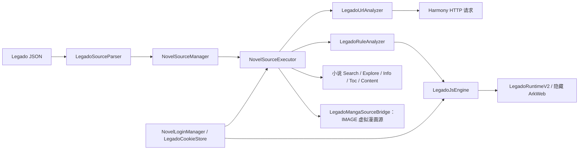
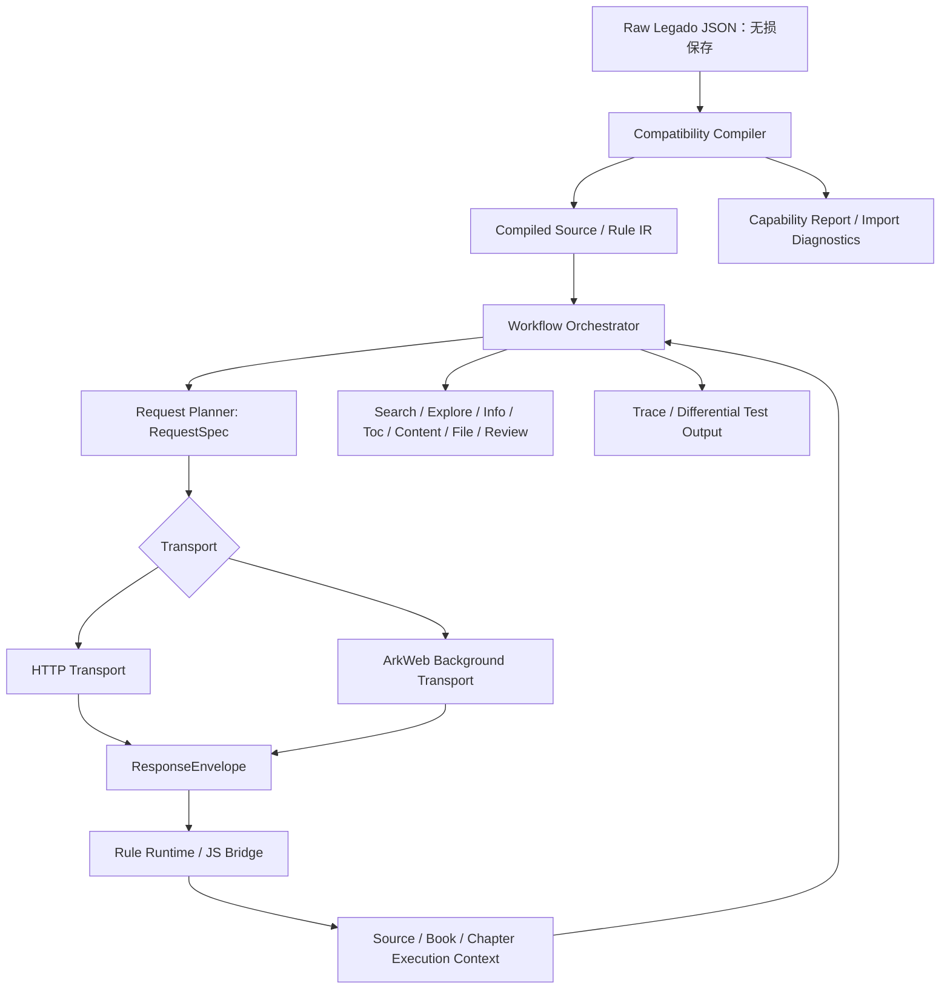

# 漫匣 Legado 书源引擎实证对照调查报告

> 调查日期：2026-07-28
> 对照对象：本仓库 `F:\DevEcoStudioProject\manxia\legado` 中的 Legado 原版实现
> 被审计书源包：`F:\Downloads-E\墨辰整理书源大全7.1（禁止倒卖）.【最新完整】.json`
> 书源包指纹：UTF-8、4,838,716 bytes、SHA-256 `473048A191DE4749FA9C15E0A2F2328A3E86B385A5FCE23EA30432D598D03A67`

## 1. 结论先行

漫匣当前已经具备 **Legado 格式书源的导入、搜索、发现、详情、目录、正文五段主链的真实实现**。它不是只把 JSON 存起来的空壳：`NovelSourceManager` 有业务入口，`NovelSourceExecutor` 实际请求网络并调用 `LegadoUrlAnalyzer`、`LegadoRuleAnalyzer`、`LegadoJsEngine`，小说阅读页和 IMAGE 虚拟漫画桥接也会进入同一执行器。

但它目前不能被称为“原版 Legado 规则引擎的等价实现”。根本原因不是少几个字段，而是两者的执行模型不同：原版把 URL option、Cookie、限速、重试、WebView、重定向和响应元数据收敛在统一的 `AnalyzeUrl` 语义层；漫匣虽然能解析其中一部分字段，却在普通请求链上把它们降为单一 Harmony HTTP 请求，因而没有完整穿透到实际行为。

对指定书源包的结论应严格分层：

| 判断 | 结果 | 含义 |
| --- | ---: | --- |
| JSON 可解析 | 458 / 458 | 文件是有效 JSON 数组；不代表书源可用。 |
| 满足漫匣当前 `validate()` 的浅校验 | 458 / 458 | 仅检查 `bookSourceUrl`、`bookSourceName` 和 `searchUrl` / `exploreUrl` 至少一个。 |
| 含显式 JS 规则标记 | 328 / 458 | 其中有 281 条含 `@js:`，163 条含 `<js>` 或 `{{js...`；两类有重叠。 |
| 含至少一项已知语义差异特征 | 114 / 458 | 见第 5.5 节；这是风险标记，不是可相加的失败数。 |
| 缺少常规“搜索-详情-目录-正文”链关键规则之一 | 49 / 458 | 其中部分可能本来就是 FILE、AUDIO、IMAGE 或特殊源，不能直接判死。 |
| 未命中以上两类静态筛查 | 314 / 458 | 只是较好的候选集，绝不是“已验证可用”。 |

已经做了一条 **无登录、无显式 JS、JSONPath 为主** 的真实四段网络样本验证：搜索、详情、目录、单章正文端点均返回成功，且书源的静态 Header 是详情/目录/正文请求成功所必需的。这证明漫匣当前的普通 HTTP + Header + JSONPath 主链具备真实可行性；它不能外推出该包其余 457 条，也不能证明复杂 JS、WebView、登录、付费、文件下载或图片解密已兼容。

最重要的产品判断如下：

1. “458 条能导入”是事实，但只代表浅层结构可接受，不代表“458 条能正常阅读”。
2. 至少 15 条 `bookSourceType=4` 是书源包自己的影视类扩展，既不属于原版 Legado 的 0-3 类型，也不应在漫匣中静默改写为 TEXT。
3. 书源包中明确出现的 `webView`、`preUpdateJs`、`formatJs`、正文 `title`、`sourceRegex`、`downloadUrls`、`payAction`、`imageDecode`、`concurrentRate` 等语义，当前存在确定的未执行、未贯通或弱化点。
4. 若目标是“真正兼容 Legado”，应重构为统一的规则编译、请求计划、传输层、运行时桥接和工作流编排，而不是继续按书源现象加 `if` 或正则补丁。第 8 节给出完整路线。

本报告刻意排除漫匣自有的扩展 JSON / ArkWeb 漫画图源体系；它们不是本次用户指定的 Legado 书源兼容问题。

## 2. 证据标准、范围与限制

### 2.1 证据等级

| 等级 | 定义 | 本报告中的用法 |
| --- | --- | --- |
| A：源码可达 | 从公开入口沿调用链能到达实际实现。 | 用于判断漫匣是否真的有搜索、目录、正文、登录、IMAGE 桥接等业务链。 |
| B：静态包审计 | 直接解析指定 JSON 并统计字段、规则语言和特征。 | 用于 458 条书源的结构、类型、风险特征统计。 |
| C：端点实测 | 对公开端点发起只读请求，并按书源规则字段核对响应结构。 | 用于一条普通 JSONPath 书源的搜索到正文闭环。 |
| D：未证实 | 有字段、函数名或注释，但本次没有可重复的完整运行证据。 | 明确标记，不将其写成“兼容”。 |

### 2.2 已做的工作

- 直接读取漫匣的 Legado 解析、管理、执行、URL、规则、JS Runtime、登录、Cookie、IMAGE 桥接源码。
- 直接读取本地 `legado` 原版的实体、`AnalyzeUrl`、`AnalyzeRule`、`WebBook`、`BookInfo`、`BookChapterList`、`BookContent` 源码。
- 用 UTF-8 解析指定书源包，进行字段统计、规则语法特征扫描和静态分类；没有执行包内第三方 JavaScript。
- 对一条不依赖显式 JS 的 JSON API 书源，以该书源真实 URL、Header、JSONPath 规则逐步做只读网络验证。
- 对另一条候选 API 做过只读探测，获得 HTTP 502；该结果没有被用来认定书源失效，因为它只能说明当时端点或网络不可达。

### 2.3 本报告不声称的内容

- 没有在 HarmonyOS 真机中把 458 条全部导入并逐条跑完搜索、详情、目录、正文。
- 没有执行书源包的混淆或第三方 JS，也没有用真实账号、验证码、付费、借阅、下载、浏览器跳转流程做验证。
- 没有把单一站点当天的网络结果归因给引擎，也没有把单条成功样本外推为整个书源包成功率。
- “未找到消费者”是对普通 Legado 执行链的源码检索结论，不等价于某个页面、实验分支或未来代码永远不会使用该字段。

## 3. 漫匣当前 Legado 书源链的真实结构



### 3.1 模块与实际职责

| 模块 | 漫匣实际职责 | 结论 |
| --- | --- | --- |
| `LegadoSourceParser.ets` | 把 JSON 映射为 `LegadoBookSource` 与各规则对象，兼容部分旧扁平字段。 | 真正的导入解析器；同时存在字段丢失、默认值改写和未知类型降级。 |
| `NovelSourceManager.ets` | 管理书源、缓存 `NovelSourceExecutor`，向页面提供 search / explore / info / toc / content。 | 不是声明层，业务入口可达。 |
| `NovelSourceExecutor.ets` | 五段阅读链、分页、请求 Header、详情/章节/正文结果组装。 | 当前兼容层的主控制器；也是请求语义丢失最集中的位置。 |
| `LegadoUrlAnalyzer.ets` | URL 模板、占位符、URL option、部分 JS 和变量解析。 | 能识别多个 Legado option，但输出对象没有完整保留所有原版语义。 |
| `LegadoRuleAnalyzer.ets` | CSS、XPath、JSONPath、Regex、JS、`&&` / `||` / `%%`、`##`、`@put` / `@get` 等规则处理。 | 有真实规则解析实现，不宜描述为只支持 CSS。 |
| `LegadoJsEngine.ets` | JS 调度、上下文、source effects、Native 诊断入口。 | 默认不走 Native JSVM，而是转到 V2 Runtime。 |
| `LegadoRuntimeV2.ets` 与 `rawfile/legado_runtime.html` | 隐藏 ArkWeb 中执行 JS，通过 replay bridge 访问 HTTP、Cookie、缓存、文件、摘要算法等。 | 有真实运行层和桥接，不是空接口；API 覆盖并不等价于原版 Rhino/Android 环境。 |
| `NovelLoginManager.ets` / `LegadoCookieStore.ets` | 登录 UI 解析、登录信息/变量/Header/Cookie 的存储与部分 JS 登录。 | 存在真实实现，但普通 URL 表单登录缺少可绑定的页面级 WebView。 |
| `LegadoMangaSourceBridge.ets` | 将 IMAGE 类型 Legado 书源投影为漫匣虚拟漫画源。 | IMAGE 有实际复用路径；不表示图片解密等所有 IMAGE 特性已等价。 |

### 3.2 关键源码链路

- 导入对象构造：`LegadoSourceParser.ets:94-160`。
- 当前浅校验：`LegadoSourceParser.ets:994-1022`。
- 管理器到执行器：`NovelSourceManager.ets:406-623`。
- 五段核心：`NovelSourceExecutor.ets:239-704, 1041-1057`。
- 普通请求：`NovelSourceExecutor.ets:1111-1222`。
- 书源 Header 合并：`NovelSourceExecutor.ets:1661-1752`。
- 详情、目录、正文解析：`NovelSourceExecutor.ets:2078-2167, 2479-2666`。
- 默认 JS Runtime：`LegadoJsEngine.ets:171, 590-593`。

## 4. Legado 原版的比较基线：不是“JSON 字段集合”

本地原版的书源类型仅定义了四种：`0 TEXT`、`1 AUDIO`、`2 IMAGE`、`3 FILE`，见 `legado/app/src/main/java/io/legado/app/constant/BookSourceType.kt:6-17`。因此，书源包的 `type=4` 不是“Legado 原版少支持一种类型”，而是包作者加入的扩展语义；漫匣若要支持它，应显式作为插件/适配器能力处理，而不能假装它是 TEXT。

原版的关键架构是：

```text
BookSource / 规则对象
  -> WebBook 的 Search / Explore / Info / Toc / Content 编排
  -> AnalyzeUrl 统一解析 URL 与请求 option
  -> HTTP 或 BackstageWebView
  -> StrResponse（body + 最终 URL + 请求/响应语义）
  -> AnalyzeRule / 各工作流解析与持久化
```

`AnalyzeUrl` 持有 `retry`、`useWebView`、`webJs`、`enabledCookieJar`、`webViewDelayTime`、`serverID` 和 `ConcurrentRateLimiter`（`AnalyzeUrl.kt:106-117`）。它在 `getStrResponseAwait()` 中先做限速与 Cookie，再根据 `useWebView` 分支到普通 HTTP 或 `BackstageWebView`，并把 `webJs`、`sourceRegex`、Header、延迟传进去（`AnalyzeUrl.kt:400-440`）。

这意味着原版的兼容点是“每个工作流拿到同一种请求语义”，而不是“各工作流各自把 URL 字符串发出去”。这是漫匣与原版最需要收敛的原理差异。

## 5. 指定书源包的全量静态审计

### 5.1 基础结构与类型

| 项目 | 数量 | 审计结论 |
| --- | ---: | --- |
| 书源总数 | 458 | 顶层为数组，UTF-8 JSON 成功解析。 |
| `bookSourceUrl`、`bookSourceName` 非空 | 458 | 满足当前浅校验的基本条件。 |
| 同时没有 `searchUrl` 和 `exploreUrl` | 0 | 所有源至少有一个入口。 |
| `bookSourceType=0` 文本 | 339 | 常规小说主群。 |
| `bookSourceType=1` 音频 | 35 | 需要音频内容消费语义。 |
| `bookSourceType=2` 图片 | 54 | 可进入 IMAGE 虚拟漫画桥接，但不自动等价于图片解密。 |
| `bookSourceType=3` 文件 | 15 | 应走文件下载语义，不能仅按普通目录/正文处理。 |
| `bookSourceType=4` | 15 | 非原版 Legado 标准类型；当前漫匣会静默映射为 TEXT。 |
| `bookSourceUrl` 非 HTTP(S) | 15 | 相对 URL 基准、`source.key` 等用法需逐源判断，不能假定安全。 |

当前 `parseBookSourceType()` 只显式处理 0-3，其他数值走 `default: TEXT`（`LegadoSourceParser.ets:685-693`）。因此 15 条 `type=4` 即使“导入成功”，其业务类型也已经被改写；这不是可接受的兼容结果。

### 5.2 常规五段流所需字段

下表用于衡量“能否走典型的搜索-详情-目录-正文路线”，而不是给所有类型判定好坏。FILE、AUDIO、IMAGE 和通过 JS 构造结果的书源可能有意省略某些字段。

| 缺口或入口 | 数量 |
| --- | ---: |
| 有 `searchUrl` | 447 |
| 有 `exploreUrl` | 362 |
| 缺 `ruleSearch.bookList` | 10 |
| 缺 `ruleSearch.bookUrl` | 14 |
| 缺 `ruleBookInfo.name` | 136 |
| 缺 `ruleToc.chapterList` | 9 |
| 缺 `ruleToc.chapterUrl` | 29 |
| 缺 `ruleContent.content` | 23 |

`validate()` 不会拒绝这些情况，只在 `searchUrl` 存在时对缺 `bookList` 打警告，最后仍返回 `true`。因此 “458 / 458 通过 validate” 是一个导入资格数字，不是工作流可用率。

### 5.3 规则语言与运行时依赖

对 `searchUrl`、`exploreUrl` 以及 Search / Explore / BookInfo / Toc / Content 五类规则对象中的字符串进行扫描，按“涉及书源数”计：

| 特征 | 涉及书源数 | 含义 |
| --- | ---: | --- |
| `@js:` | 281 | 至少一个工作流含显式 JS。 |
| `<js>` 或 `{{js...` | 163 | 另一种显式 JS 写法；与上一项重叠。 |
| 任一显式 JS 标记 | 328 | 这些源不能只靠静态选择器兼容。 |
| JSONPath | 191 | JSON API 类源占有明显比例。 |
| XPath | 4 | 量少，但仍需要真实 XPath 语义。 |
| 显式 CSS 标记 | 37 | 仍存在传统 HTML 选择器使用场景。 |
| `@put` | 62 | 规则内状态写入。 |
| `@get` | 46 | 规则内状态读取。 |
| `##` 替换规则 | 357 | 文本清洗/转换依赖广泛。 |
| `&&` 组合规则 | 202 | 规则组合语义不能被简单字符串拆分破坏。 |

这组数据说明：指定包的主体不是“几条 CSS 选择器”，而是一个依赖规则 DSL、状态、副作用、HTTP option 与 JS Runtime 的配置集合。只验证 JSON 反序列化或简单 CSS 源，无法得出整体兼容结论。

### 5.4 URL option、登录和状态需求信号

同一运行规则范围的静态信号如下：

| 信号 | 涉及书源数 | 当前含义 |
| --- | ---: | --- |
| `webView` | 63 | 普通 `executeRequest()` 没有按该标志路由到 ArkWeb。 |
| `charset` | 53 | 当前普通 HTTP 有 charset 解码路径，不能单独视为缺陷。 |
| `method` | 126 | 当前普通 HTTP 支持 GET/POST；复杂 method option 仍需差分测试。 |
| `retry` | 1 | 解析到 `ParsedUrlRequest`，但普通执行器没有消费重试次数。 |
| `loginUrl` | 114 | 需要登录入口或初始化脚本。 |
| `loginUi` | 31 | 需要表单 UI 映射。 |
| `loginCheckJs` | 13 | 需要登录状态的 JS 校验。 |

这些数字是“代码中出现该语义”的下限，不表示每个用户动作都会走到该分支。尤其 `webView` 不能与其他数量相加成“失败书源数”。

### 5.5 已知差异字段的包内影响

| 字段或语义 | 包内数量 | 漫匣现状 | 原版行为 / 影响 |
| --- | ---: | --- | --- |
| 原始 `weight != 0` | 27 | 导入时统一写为 `0`。 | 排序偏好不保真。原版实体保留该值。 |
| `bookSourceType=4` | 15 | 静默改为 TEXT。 | 原版没有 type 4；应报为扩展或不支持。 |
| `ruleBookInfo.downloadUrls` | 24 | 详情组装不写入下载结果。 | 原版 `BookInfo.kt:157-165` 解析文件下载 URL；15 个 FILE 源中有 14 个使用它。 |
| `ruleBookInfo.canReName` | 32 | 详情结果未按该规则处理。 | 原版 `BookInfo.kt:65-72` 控制改名。 |
| `ruleToc.preUpdateJs` | 10 | 普通目录链未找到消费点。 | 原版 `WebBook.runPreUpdateJs()` 在目录前执行。 |
| `ruleToc.formatJs` | 1 | 普通目录链未找到消费点。 | 原版对每章标题执行 JS 格式化。 |
| `ruleContent.title` | 7 | 正文链未更新章节标题。 | 原版 `BookContent.kt:66-77` 会更新并持久化标题。 |
| `ruleContent.sourceRegex` | 8 | 未传入普通请求的 WebView 路径。 | 原版传给 `BackstageWebView`。 |
| `ruleContent.payAction` | 6 | 未找到普通正文消费点。 | 付费/借阅动作不能声称已支持。 |
| `ruleContent.imageDecode` | 2 | 未找到普通图片字节解密消费点。 | 需要专门的图片二进制处理和 JS bridge。 |
| `ruleContent.callBackJs` | 3 | 本地类型未声明，导入后丢失。 | 这是包扩展字段，也不属于当前原版 `ContentRule` 标准。 |
| `concurrentRate` | 14 | Parser 保存，但普通请求链未使用。 | 原版 `AnalyzeUrl` 创建并使用 `ConcurrentRateLimiter`。 |
| `bookUrlPattern` | 71 | Parser 保存，未找到匹配 URL 自动选源的普通业务路径。 | 原版可在相关书架/选源路径使用此语义。 |

按以下条件取并集：非 0-3 类型、`downloadUrls`、`preUpdateJs`、`formatJs`、正文 `title`、`sourceRegex`、`payAction`、`imageDecode`、`callBackJs`、`concurrentRate`、规则范围内 `webView`，共有 **114 条** 书源命中至少一个已知差异信号。另有 **49 条** 缺少常规五段流关键规则，二者重叠 19 条。这个分类用于排优先级，而不是宣告 114 条必然失败、314 条必然成功。

## 6. 逐模块、逐工作流对照

### 6.1 导入、模型和未知字段

| 维度 | Legado 原版 | 漫匣实际实现 | 判断 |
| --- | --- | --- | --- |
| 原始类型 | 只认可 0-3。 | 0-3 映射正确，其他数值默认为 TEXT。 | 不应静默降级。 |
| 原始权重 | `BookSource` 持有原值。 | Parser 在 `LegadoSourceParser.ets:151` 固定 `weight: 0`。 | 导入不保真。 |
| 规则对象 | 有稳定实体与字段语义。 | 大部分同名字段进入 `LegadoSourceTypes.ets`。 | “保存字段”不等于“运行字段”。 |
| 未知扩展 | 上游不保证处理。 | 没有 raw JSON 保真容器，`callBackJs` 等会丢失。 | 未来升级与诊断困难。 |
| 校验 | 有运行工作流与源校验体系。 | 当前只做浅校验。 | 应从布尔校验升级为能力报告。 |

### 6.2 Search 与 Explore

**原版。** `WebBook.searchBookAwait()`、`WebBook.exploreBookAwait()` 经 `AnalyzeUrl` 请求，再交 `AnalyzeRule` 解析。

**漫匣。** `NovelSourceExecutor.search()`、`searchWithError()` 与 `explore()` 有真实请求和 `parseSearchResultAsync()` / `parseExploreResultAsync()`；`NovelSourceManager` 对外提供入口。搜索结果会读取 `bookList`、`name`、`author`、`intro`、`kind`、`lastChapter`、`updateTime`、`bookUrl`、`coverUrl`、`wordCount` 等。

**结论。** 普通 HTTP、Header、GET/POST、JSONPath/CSS/Regex 规则的 Search / Explore 主链存在。真正的风险在请求模型：需要 `webView`、请求级 retry、Cookie 自动回写、动态浏览器跳转或复杂 JS 的源，不能因为 Search 函数存在就判为等价。

### 6.3 BookInfo

**漫匣实际消费。** `parseBookInfoAsync()` 会处理 `init`、`name`、`author`、`kind`、`intro`、`coverUrl`、`tocUrl`、`lastChapter`、`wordCount`，见 `NovelSourceExecutor.ets:2078-2167`。

**确定差异。** `canReName` 和 `downloadUrls` 被类型和 parser 保存，但当前详情结果没有将它们落到书籍模型和文件下载流程。对包内 24 条 `downloadUrls`，特别是 FILE 源，这不是边缘体验问题，而是其设计目标没有被完成。

### 6.4 Toc

**原版。** `WebBook.runPreUpdateJs()` 在目录更新前执行 `preUpdateJs`；`BookChapterList` 支持多个 `nextTocUrl`，对多页用有限并发，并在末尾对 `formatJs` 执行章节标题格式化。

**漫匣。** `getChapterList()` 顺序请求，页上限 50；`parseChapterListWithNext()` 解析 `chapterList`、`chapterName`、`chapterUrl`、`isVolume`、`isVip`、`isPay`、`updateTime`，并通过 `extractFirstParsedUrlFromRule()` 只取一个目录下一页（`NovelSourceExecutor.ets:613-652, 2479-2541`）。

**判断。** 这是“存在有限的顺序分页”，不是“没有目录分页”；但对多分支目录、预刷新 JS、标题整理，语义弱于原版。

### 6.5 Content

**原版。** `BookContent` 先处理 `title`，再解析正文和下一页；单下一页顺序追踪、多下一页使用有限并发，最终应用 `replaceRegex`。`WebBook.getContentAwait()` 会将 `webJs`、`sourceRegex` 交给 `AnalyzeUrl`。

**漫匣。** `getContent()` 使用顺序队列，页上限 20；`parseContentWithNext()` 会消费 `content`、`nextContentUrl`、`replaceRegex`，并对 AUDIO、IMAGE 做分支处理（`NovelSourceExecutor.ets:654-704, 2549-2666`）。

**确定差异。** 普通正文路径没有消费 `title`、`sourceRegex`、`payAction`、`imageDecode`；多 URL 会进入队列但逐条请求。因而普通文本页和基础替换可以工作，复杂正文的原版语义不完整。

### 6.6 URL option、传输与响应模型

这是最关键的断点。

`LegadoUrlAnalyzer` 的 `ParsedUrlRequest` 已可携带 `method`、`body`、`charset`、`useWebView`、`webJs`、`retry`（`LegadoUrlAnalyzer.ets:38-49, 1549-1576`）。它甚至识别 `type`、`serverID`、`webViewDelayTime`（`1778-1791`），但后面三项没有进入请求对象。

而 `NovelSourceExecutor.executeRequest()` 的签名是 `Promise<string | null>`，在普通链中无条件构建 Harmony `http.createHttp()` 请求（`1111-1214`）。它不会根据 `useWebView` / `webJs` / `retry` 切换传输方式或重试；返回值也没有承载最终 URL、响应 Header、重定向链和 Cookie 变化。原版在这里返回的是保留请求语义的 `StrResponse`。

所以，当前不是“没有 URL option parser”，而是“parser 和 transport 之间缺一条强类型、完整、统一的语义通路”。用单个字段修补不会改变这个结构问题。

### 6.7 Cookie、限速与登录

漫匣有 `LegadoCookieStore`、`NovelLoginManager` 和 V2 Runtime 的 Cookie bridge；`NovelSourceExecutor` 也会把书源 Header、登录 Header 合并到普通请求。这些都是实实在在的实现。

但是原版的 `enabledCookieJar` 与 `ConcurrentRateLimiter` 是统一 `AnalyzeUrl` 行为的一部分。漫匣当前普通执行器没有按 `concurrentRate` 调度，也没有证明每次普通 HTTP 请求都按原版 cookie jar 规则完成“请求前注入、响应后写回”。因此只能说“有 Cookie 与登录状态能力”，不能说“Cookie / 限速语义等价”。

`NovelLoginManager.login()` 真实解析 `loginUi`，能走 JS 登录路径，也会执行 `loginCheckJs`。但对普通 URL 表单登录，源码明确记录“需要页面级 WebView 表单提交链路，当前无可绑定 WebView”（`NovelLoginManager.ets:416-499`）。这是已实现但不完整的能力，应在 UI 上显示为受限，而不是显示为已完全登录兼容。

### 6.8 JavaScript Runtime 与 bridge

默认 `useNativeEngine=false`，JS 交给 `LegadoRuntimeV2`（`LegadoJsEngine.ets:171, 590-593`）。V2 Runtime 不是占位：它通过“执行 -> 返回 pending bridge 请求 -> ArkTS 执行 HTTP/Cookie/Cache/File/Crypto -> replay”的机制工作（`LegadoRuntimeV2.ets:279-375`）。`legado_runtime.html` 确实实现了：

- `java.ajax` / `ajaxAll` / `connect` / `get` / `post`；
- `java` 编码、摘要、HMAC、日志、toast、文件读写/下载的一部分接口；
- `source.getVariable` / `setVariable`、source data、login information；
- Cookie 与 cache bridge。

同时，默认运行时静态 API 面没有定义 `java.startBrowser`、`java.refreshTocUrl`、`java.getElements` 等包内复杂书源可能调用的接口，也没有对应的 bridge request 处理分支。以 Internet Archive 类型的复杂源为例，其规则还涉及混淆 JS、`source.getVariable/setVariable`、`book.getVariable/setVariable`、浏览器跳转、目录刷新和 UI 副作用；本次没有执行它，不能以“某些 shim 存在”推断它能运行。

对 JS 兼容的正确表述是：**漫匣有可执行、可回放、可持久化部分 source effects 的 JS Runtime；其 API 行为契约尚未对齐原版，复杂源需要逐 API 验证。**

### 6.9 FILE、IMAGE、AUDIO 与 Review

| 类型/功能 | 漫匣现状 | 对照判断 |
| --- | --- | --- |
| TEXT | 五段主链存在。 | 普通源有实际可行性。 |
| AUDIO | 正文分支保留原始内容。 | 仍需验证播放 URL、鉴权、分页和 UI 交接。 |
| IMAGE | 有 IMAGE 分支和 `LegadoMangaSourceBridge`。 | 基础图片列表可复用；`imageDecode` 未贯通。 |
| FILE | Parser 能保存 `downloadUrls`。 | 详情不解析/落地下载结果，当前不满足 FILE 设计目标。 |
| type=4 | 静默成 TEXT。 | 应拒绝、隔离或以单独插件支持。 |
| Review | 漫匣 `LegadoReviewRule` 结构比原版小，未找到普通业务执行链。 | 本包 `ruleReview=0`，对本包不是首要阻塞，但对“全原版兼容”仍是缺口。 |

## 7. 代表性真实工作流验证

### 7.1 样本选择

选择包内一条 `bookSourceType=0`、无登录、无显式 JS 的 JSON API 书源。其规则是典型 JSONPath：

```text
Search:   $.Novels -> $.NovelID / $.NovelName / $.AuthorName
BookInfo: $.data.novelId / $.data.novelName / $.data.authorName
Toc:      $.data.volumeList[*].chapterList[*] -> $.chapId / $.title
Content:  $.data.expand.content
```

该书源在 `header` 中声明了 `content-type`、`sf-minip-info` 和 `authorization`。这使它成为同时验证“规则、Header、详情、目录、正文”而非仅验证搜索页面的合适样本。

### 7.2 只读端点结果

| 阶段 | 验证动作 | 结果 |
| --- | --- | --- |
| Search | 用书源的搜索 URL、关键词“测试”请求。 | HTTP 200，返回可 JSON 解析的响应，`Novels` 有 13 项。 |
| BookInfo（无书源 Header） | 用结果中的 `NovelID` 构造书源规则定义的详情 URL。 | HTTP 401 / 错误码 507，说明 Header 不是装饰字段。 |
| BookInfo（按书源 Header） | 以配置 Header 重试完全相同的详情 URL。 | HTTP 200，`data.novelId`、`novelName`、`authorName`、`expand.latestChapter` 都存在。 |
| Toc | 使用书源规则生成的 `/dirs` URL 和同一 Header。 | HTTP 200，返回 14 个卷；首章具有 `chapId`、`title`、`isVip`。 |
| Content | 用 `chapId` 构造书源 `ruleToc.chapterUrl` 指定的 URL，并保留 Header。 | HTTP 200，`data.expand.content` 非空，长度 5,650 字符；该章返回的付费金额为 0。 |

这条结果提供三层证据：

1. 书源自身的 URL 模板与 JSONPath 字段在调查当天仍对应真实接口。
2. 该源不是“搜索有结果就可读”，详情以后必须正确传播 Header。
3. 漫匣普通链具备实现该类源所需的基础代码：`executeRequest()` 会调用 `buildHeaders()`，后者合并 `source.header`；`LegadoRuleAnalyzer` 有 JSONPath 的字符串与元素列表解析实现。

边界也同样明确：本次是从规则和端点验证链路，并未在 HarmonyOS 真机 UI 中执行这一条源。因此它是“端点与静态执行链强证据”，不是“漫匣发布版真机 E2E 已通过”的替代品。

## 8. 从补丁到语义兼容：完整重构方案

### 8.1 目标架构

要实现原版兼容，建议把当前“Parser + 多处字符串处理 + Executor 直连 HTTP”的结构，升级为以下管线：



这不是为了“抽象而抽象”。每一层都对应当前已发现的具体断裂点：字段丢失、未知类型静默降级、URL option 半途消失、HTTP/WebView 分裂、JS 副作用不可验证、工作流字段无人消费、导入成功误导用户。

### 8.2 第一层：无损 Source Schema 与兼容编译器

应保留两份数据，而不是只保留当前的简化对象：

1. `RawBookSourceDocument`：原始 JSON、未知字段、原始枚举值、字段位置和导入版本，完全无损保存。
2. `CompiledBookSource`：对标准 Legado 0-3 类型、规则对象、URL option、扩展字段做显式编译后的内部表示。

要求：

- `weight`、`customOrder`、扩展字段不能在导入时悄悄被改写或丢弃。
- `type=4` 进入 `UnsupportedExternalType(4)` 或已注册插件，而不是 TEXT。
- 对 `callBackJs`、`customButton`、`eventListener` 等非上游字段保留 raw 值并给出“扩展、未执行/已由插件执行”的诊断。
- Import API 返回 `ImportReport`，至少包含：已保留字段、已编译字段、未知字段、缺少工作流字段、所需能力、阻塞原因。不要只返回 `boolean`。

### 8.3 第二层：Rule IR，而不是继续扩张字符串补丁

Legado DSL 不是单一选择器。应把规则编译为可追踪的 IR / AST：

- selector：CSS、XPath、JSONPath、Regex；
- transform：`##`、属性取值、HTML 格式化；
- composition：`&&`、`||`、`%%`；
- variable：模板、`@put`、`@get`；
- script：`@js:`、`<js>`、`{{js...`；
- URL template 和 option block。

每个节点应保留原始文本、来源字段、解析位置和能力需求。这样可以在导入时准确回答“该源需要 WebView”“该源用了未实现的 JS API”，也能在失败 trace 中定位到某一条规则，而不是只给“解析失败”。

### 8.4 第三层：统一 RequestSpec 与 ResponseEnvelope

建立不可变的 `RequestSpec`，至少承载：

```text
url, method, body / encodedBody, headers, charset, retry,
cookiePolicy, rateLimit, webView, webJs, sourceRegex,
webViewDelayTime, serverID, redirectPolicy, traceId
```

所有 Search、Explore、BookInfo、Toc、Content、File、Review 请求都必须经由同一个 Request Planner 生成 `RequestSpec`，再交给传输层。这样 `webView`、`retry`、`sourceRegex`、`serverID` 不会在 URL parser 后消失。

传输层的返回值应是 `ResponseEnvelope`，而不是裸字符串：

```text
body, finalUrl, statusCode, requestHeaders, responseHeaders,
cookiesChanged, redirectChain, transportKind, elapsedMs, traceId
```

这是对齐原版 `StrResponse` 思路所必需的基础。正文相对 URL、Cookie 回写、重定向、WebView 捕获结果、调试日志都依赖它。

### 8.5 第四层：HTTP 与 ArkWeb 作为同一 Transport Contract

实现两个传输器，但它们必须满足同一个接口：

- `HttpTransport`：普通 GET/POST、Header、charset、Cookie、限速、retry、重定向；
- `ArkWebTransport`：后台页面加载、执行 `webJs`、按 `sourceRegex` 提取、等待 `webViewDelayTime`、回收 Cookie 与最终 URL。

`useWebView=true`、正文 `webJs` 或 `sourceRegex` 不应由调用方各自判断，而应由 Request Planner 选择 transport。限速应是每书源/域名上下文能力，而不是页面或执行器局部 sleep。

### 8.6 第五层：按契约实现 JavaScript bridge

不要再以“运行时里有同名函数”作为兼容判断。建立一个 API Contract Registry：

| 类别 | 需要验证的契约 |
| --- | --- |
| 网络 | `java.ajax`、`ajaxAll`、`connect`、Header、Cookie、响应对象、异常和同步/异步边界。 |
| source/book/chapter 状态 | `source.get/setVariable`、source data、book/chapter variable、持久化作用域与生命周期。 |
| DOM | `java.getElement(s)`、Jsoup 对象和方法的真实返回类型。 |
| 浏览器/UI | `startBrowser`、`refreshTocUrl`、验证码、toast、跳转、登录交互。 |
| 文件/二进制 | 下载、缓存、读写、图片 bytes、`imageDecode`。 |
| 加密/编码 | MD5、SHA、HMAC、base64、charset、URI 行为。 |

每个 API 要么具备可测试的端到端行为，要么明确返回结构化 `UNSUPPORTED_API` 并使工作流失败原因可见。静默空函数最危险，因为它会把“缺能力”伪装成“规则返回空”。

### 8.7 第六层：WebBook 风格工作流编排器

不要让 `NovelSourceExecutor` 继续承担全部职责。按原版语义拆分：

| 编排器 | 关键职责 |
| --- | --- |
| Search / Explore | URL 计划、请求、列表解析、关键词检查、结果诊断。 |
| BookInfo | `init`、`canReName`、目录 URL 或 FILE `downloadUrls` 的明确分支。 |
| Toc | `preUpdateJs`、多 `nextTocUrl`、去重、顺序/有限并发、`formatJs`。 |
| Content | `title`、多 `nextContentUrl`、替换、付费动作、IMAGE/AUDIO 专用输出。 |
| File | 下载候选、文件类型、进度、保存权限和错误状态。 |
| Review | 仅在完整映射后启用；否则 ImportReport 明确显示未支持。 |

让类型 0-3 成为明确的 adapter：TEXT、AUDIO、IMAGE、FILE。`type=4` 只能由独立视频/影视插件消化，不应侵入 Legado 标准内核。

### 8.8 第七层：可观测性和差分测试

完整兼容不能靠人工“试几个站”。应建立差分测试台：

1. 固定 HTTP fixture：保存合法、公开的 HTML/JSON/重定向/Cookie 响应，不执行来源未知 JS。
2. 对同一 Source JSON，在原版 Legado 和漫匣分别输出 trace：解析后的请求、Header、变量变化、Cookie、最终 URL、列表、章节、正文。
3. 对 `RequestSpec`、`ResponseEnvelope`、规则结果和副作用做 golden diff；不只比最终文本。
4. 把公开、无登录的真实端点做小规模 smoke test；网络失效与引擎回归分开报告。
5. 对复杂 JS 建立 API contract fixture，不把生产书源的混淆代码当作唯一测试工具。

用户界面和调试页也要显示分层状态：`可解析`、`可编译`、`已完成请求`、`已完成工作流`、`需要 WebView`、`需要 JS API`、`不支持扩展类型`。这会终止“导入成功但无法阅读”的黑箱体验。

## 9. 分阶段迁移与验收标准

| 阶段 | 交付 | 验收门槛 |
| --- | --- | --- |
| 0. 基线冻结 | 本报告中的字段矩阵、458 条静态 capability 清单、代表性 fixture。 | 后续改动可量化比较，不再用感觉判断。 |
| 1. 无损导入 | Raw JSON 持久化、未知字段保留、type=4 显式诊断、ImportReport。 | 458 条原始 JSON 可 round-trip；不再把未知 type 改成 TEXT。 |
| 2. 请求内核 | `RequestSpec`、`ResponseEnvelope`、统一 Cookie/限速/retry、HTTP transport。 | URL option 的每一字段都有可追踪去向；Header 样本四段回归通过。 |
| 3. ArkWeb transport | `webView`、`webJs`、`sourceRegex`、delay、最终 URL/Cookie 回写。 | WebView fixture 与原版 request/response trace 对齐。 |
| 4. 工作流语义 | `preUpdateJs`、`formatJs`、正文 `title`、多页、FILE、IMAGE decode。 | 包内相应字段不再是“保存但无消费者”。 |
| 5. JS Contract | bridge API 清单、状态持久化、浏览器/UI/文件能力的明确支持或拒绝。 | 复杂 JS 不再静默返回空；每个 API 有 fixture。 |
| 6. 灰度切换 | 按书源 feature flag 和 shadow trace 切换新内核。 | 同一源新旧结果差异可见、可回滚；通过后再扩大范围。 |

最终验收不应是“能导入多少条”，而应至少满足：

- 原版 0-3 类型的原始字段和未知扩展字段均无损保留；
- 每个 URL option 在 trace 中可看到“已执行、已忽略且有理由、或不支持”的结论；
- `preUpdateJs`、`formatJs`、`title`、`downloadUrls`、`sourceRegex` 等不再只有类型定义；
- 对固定 fixture，漫匣与原版的请求、变量、副作用和解析结果可差分；
- 对真实端点，网络不可达、鉴权失败、规则失败、Runtime 缺 API、WebView 失败能被区分；
- 用户不再把“导入成功”理解为“书源已验证可读”。

## 10. 最终定位

当前漫匣最准确的定位是：

> 支持大量 Legado JSON 字段，并已实现普通小说/IMAGE 的核心阅读工作流；对规则、HTTP、Header、JSONPath/CSS/Regex 和部分 JS/状态有真实运行能力，但尚未达到原版 Legado 的统一请求语义、WebView、JS API 契约与全部工作流字段的等价水平。

这不是否定现有实现。它已经拥有可继续演进的 Parser、RuleAnalyzer、Runtime、Cookie/Login、Manager 和工作流基础。问题在于兼容边界目前分散且不透明。只要按第 8 节把兼容目标转化为“无损模型 + 规则 IR + RequestSpec/ResponseEnvelope + Transport Contract + JS Contract + 差分测试”，漫匣才能从“对大量书源尽力兼容”变成“对 Legado 语义可证明兼容”。

## 附录 A：主要源码证据索引

| 主题 | 漫匣 | Legado 原版 |
| --- | --- | --- |
| 类型、导入、浅校验 | `LegadoSourceParser.ets:94-160, 685-693, 994-1022` | `constant/BookSourceType.kt:6-17` |
| 五段业务入口 | `NovelSourceManager.ets:406-623` | `model/webBook/WebBook.kt` |
| 请求与 Header | `NovelSourceExecutor.ets:1111-1222, 1661-1752` | `model/analyzeRule/AnalyzeUrl.kt:106-117, 400-440` |
| URL option | `LegadoUrlAnalyzer.ets:38-49, 1549-1576, 1778-1791` | `model/analyzeRule/AnalyzeUrl.kt:241-245, 703-808` |
| 详情 | `NovelSourceExecutor.ets:2078-2167` | `model/webBook/BookInfo.kt:55-165` |
| 目录 | `NovelSourceExecutor.ets:613-652, 2479-2541` | `model/webBook/WebBook.kt:211-235`, `BookChapterList.kt:131-195` |
| 正文 | `NovelSourceExecutor.ets:654-704, 2549-2666` | `model/webBook/BookContent.kt:49-153` |
| 规则 DSL | `LegadoRuleAnalyzer.ets:507-590, 767-995, 1308-1476, 2009-2200` | `model/analyzeRule/AnalyzeRule.kt` |
| JS Runtime | `LegadoJsEngine.ets:171, 590-593`; `LegadoRuntimeV2.ets:279-375`; `rawfile/legado_runtime.html:646-959` | 原版 Rhino / Android WebView 相关调用由 `AnalyzeUrl` 与 `WebBook` 使用 |
| 登录 | `NovelLoginManager.ets:416-499, 681-696` | 原版登录状态与 WebView 请求路径 |
| IMAGE 桥接 | `LegadoMangaSourceBridge.ets:229-277, 697-707` | `BookSourceType.image` 语义 |

## 附录 B：可复核的统计定义

- “浅校验通过”：按当前 `validate()` 的三项条件对 JSON 原始值求值。
- “显式 JS 标记”：在五段工作流 URL/规则字符串中匹配 `@js:`、`<js>` 或 `{{js`；不执行任何脚本。
- “已知语义差异特征”：第 5.5 节列出的未贯通字段和规则范围内 `webView` 的并集。
- “缺常规五段流关键规则”：`ruleSearch.bookList`、`ruleSearch.bookUrl`、`ruleToc.chapterList`、`ruleToc.chapterUrl`、`ruleContent.content` 任一缺失。
- 所有计数按书源去重；不同特征之间允许重叠，因此严禁把各行数字相加为失败总数。

<!-- LEGADO_COMPATIBILITY_EXECUTION_STATUS:START -->
## 自动化执行状态

最后刷新：2026-08-14T19:16:56.3150764+00:00

| 阶段 | 状态 | 结论 |
| --- | --- | --- |
| 阶段 0：基线与差分平台 | planned |  |
| 阶段 1：无损导入与存储 | planned |  |
| 阶段 2：规则编译器与请求内核 | planned |  |
| 阶段 3：ArkWeb 统一传输 | planned |  |
| 阶段 4：工作流与类型适配 | planned |  |
| 阶段 5：JS API 契约 | planned |  |
| 阶段 6：全局 V2 切换、界面与收敛 | planned |  |
| 阶段 7：V2 全局路径封口与真机验收 | planned |  |
| 阶段 7A：原版 Legado 同端点差分诊断 | planned |  |
| 阶段 8：能力矩阵扩展与上线收敛 | planned |  |

## 持续真机治理状态

该区块只读取 `tools/legado-compat/state/full-source-validation-state.json`，与阶段状态机分开呈现。它记录后续逐源真机治理与 UI 回归，**不会将阶段 7 的历史失败改写为通过**。

| 范围 | 状态 | 脱敏摘要 |
| --- | --- | --- |
| 真机持久化“完整验证”（唯一设备级口径） | observed_incomplete | 完整验证=0/458；策略=v2_full_cutover；证据=tmp/book-source-management-r4-20260809-unlocked/result.json |
| Harness / 状态机逐源执行账本（不等同真机完整验证） | blocked | 总数=458；planned=0；running=0；verifying=0；passed=4；failed=50；expected_external=0；needs_interaction=158；policy_blocked=95；blocked=151 |
| V2 语义资格（fixture、trace 与参考差分；不等同真机完整验证） | evidence | unverified=65；execution_verified_no_reference=19；semantic_match=0；semantic_mismatch=1；external_confirmed=0；endpoint_unconfirmed=50；needs_interaction=158；policy_rejected=95；engine_rejected=20；arkweb_unconfirmed=1；harness_or_engine_failure=43 |
| 持续治理台账 | running | 活跃任务：COMPAT-006；议题：planned=10；running=0；verifying=29；passed=102；failed=59；blocked=158；expected_external=1；needs_interaction=50 |
| 当前机器活动源码议题 | ISSUE-COMPAT-244-JSOUP-HTML-ENTITY-SEMANTICS | verifying；244 R4 统一验证全部 8 步完成：干净单一 run（v2-hypium-full-17516-1786713467539）458/458 终态可追溯（step4-full-batch.json）；1 处 semanticDifference（ordinal 8 reference_success_v2_http_error=外部站点 HTTP 503，非实体语义缺陷，不新增根因）；fixed Legado 同输入差分 witness OK、V2 差分除单对象投影格式缺口（归 231）外一致；hvigor 构建、安装、真机冷启动与 Hypium、书源管理页 54/54 渲染完成（ledger completed）。244 仍保持 verifying：最终 passed/semantic_match 需用户批准。 |

详细治理问题、证据路径和状态转换以该机器事实源为准；原始书源、Cookie、账号、正文和密钥均不进入本区块。

详细证据见 `docs/analysis/Legado书源引擎证据索引.md`。该区块由总控自动更新，不改写本报告的调查结论；持续治理证据也不会覆盖阶段 7 的历史状态。
<!-- LEGADO_COMPATIBILITY_EXECUTION_STATUS:END -->
