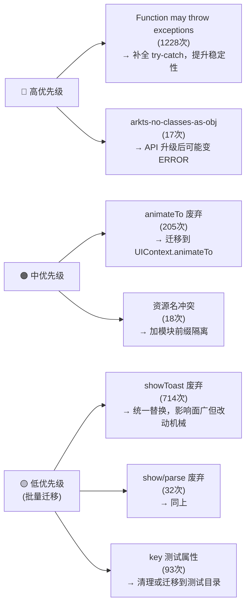

# 编译 WARN 分析报告

> 构建命令：`assembleHap --no-daemon --stacktrace`  
> 构建结果：✅ BUILD SUCCESSFUL（耗时 53 s 563 ms）  
> 统计时间：2026-06-02

---

## 总体概览

| 维度 | 数量 |
|------|------|
| **ArkTS WARN 总条目** | **2725 次** |
| 来自项目自身代码 | 2703 次 |
| 来自 oh_modules 三方库 | 22 次 |
| 非 ArkTS 类 WARN（资源/打包） | ~20 次 |

---

## 一、按 WARN 类型分类

### 🔴 类型1：`Function may throw exceptions`（**1228 次**，占比最高）

**警告含义**：函数内部可能抛出异常，但调用方没有做 `try-catch` 处理。

**严重等级**：⚠️ 中等 — 不影响编译但运行时一旦抛异常可能导致页面崩溃。

**根因**：项目中大量异步操作、IO 操作（文件读写、网络请求、解压等）调用了可能 throw 的函数，但未包裹在 `try-catch` 中。ArkTS 静态分析能识别此类风险。

**修复方向**：
```typescript
// ❌ 当前写法（触发 WARN）
const result = someThrowableFunction()

// ✅ 正确写法
try {
  const result = someThrowableFunction()
} catch (e) {
  const err = e as Error
  logger.error(`操作失败: ${err.message}`)
}
```

---

### 🔴 类型2：`'showToast' has been deprecated`（**714 次**）

**警告含义**：`promptAction.showToast()` 全局函数已废弃。

**严重等级**：⚠️ 中等 — 当前仍可使用，但后续 SDK 升级可能移除。

**迁移方案**：改用 `UIContext.showToast()`
```typescript
// ❌ 废弃写法
import promptAction from '@ohos.promptAction'
promptAction.showToast({ message: 'xxx' })

// ✅ 新写法
this.getUIContext().showToast({ message: 'xxx' })
```

> **分布**：广泛分布在几乎所有 page 文件中，属于全局性迁移需求。

---

### 🟠 类型3：`'animateTo' has been deprecated`（**205 次**）

**警告含义**：全局 `animateTo()` 函数已废弃，应改为 `UIContext.animateTo()`。

**严重等级**：⚠️ 中等 — 功能可用，但 API 规范已明确要求迁移。

**迁移方案**：
```typescript
// ❌ 废弃写法
animateTo({ duration: 300 }, () => {
  this.isVisible = true
})

// ✅ 新写法（在 Component 内）
this.getUIContext().animateTo({ duration: 300 }, () => {
  this.isVisible = true
})
```

**重点文件**：[MainMenuPage.ets](file:///F:/DevEcoStudioProject/manxia/entry/src/main/ets/pages/MainMenuPage.ets) 共 **~60+ 次**，是重灾区。

---

### 🟠 类型4：`'key' can only be used for testing directories`（**93 次**）

**警告含义**：`.key()` 属性修饰符只能在测试目录中使用，生产代码中使用会产生 WARN。

**严重等级**：⚠️ 低-中 — 功能正常，但表明生产代码混用了测试用标识符，不符合规范。

**分布**：集中在 [MainMenuPage.ets](file:///F:/DevEcoStudioProject/manxia/entry/src/main/ets/pages/MainMenuPage.ets)（约 15 处）及多个页面。

**修复方向**：  
如果这些 `key` 是为了自动化 UI 测试而标记的组件，应将测试相关代码迁移至 `ohosTest` 目录，或考虑是否真的需要保留。

---

### 🟡 类型5：`'show' has been deprecated`（**31 次**）

**警告含义**：`promptAction.showDialog()` / `showActionMenu()` 的 `.show()` 方法已废弃。

**迁移方案**：改用 `UIContext` 下的对应接口或 `@ohos.promptAction` 的新 API。

---

### 🟡 类型6：`Classes cannot be used as objects (arkts-no-classes-as-obj)`（**17 次**）

**警告含义**：ArkTS 强制名义类型系统，禁止把类本身当普通对象来操作（如把类赋给 `object` 类型变量、动态访问类静态属性等）。

**严重等级**：⚠️ 中等 — 可能在严格模式下升级为 ERROR。

**修复方向**：消除把类当对象的用法，改用工厂函数、抽象接口或静态方法。

---

### 🟡 类型7：`'parse' has been deprecated`（**1 次**）

**警告含义**：某处使用了已废弃的 `parse()` 方法（可能是 `util.TextDecoder` 或 XML 解析器相关）。

**影响**：极低，仅 1 处，可快速定位修复。

---

## 二、按文件分布（Top 15）

| 排名 | 文件 | WARN 数 |
|------|------|---------|
| 1 | [MainMenuPage.ets](file:///F:/DevEcoStudioProject/manxia/entry/src/main/ets/pages/MainMenuPage.ets) | **121** |
| 2 | [NovelReaderPage.ets](file:///F:/DevEcoStudioProject/manxia/entry/src/main/ets/pages/NovelReaderPage.ets) | 46 |
| 3 | [BackupPage.ets](file:///F:/DevEcoStudioProject/manxia/entry/src/main/ets/pages/BackupPage.ets) | 36 |
| 4 | [MangaReaderPage.ets](file:///F:/DevEcoStudioProject/manxia/entry/src/main/ets/pages/MangaReaderPage.ets) | 36 |
| 5 | [EBookReaderPage.ets](file:///F:/DevEcoStudioProject/manxia/entry/src/main/ets/pages/EBookReaderPage.ets) | 35 |
| 6 | [FileEditorPage.ets](file:///F:/DevEcoStudioProject/manxia/entry/src/main/ets/pages/FileEditorPage.ets) | 33 |
| 7 | [TransferPage.ets](file:///F:/DevEcoStudioProject/manxia/entry/src/main/ets/pages/TransferPage.ets) | 30 |
| 8 | [NovelDetailPage.ets](file:///F:/DevEcoStudioProject/manxia/entry/src/main/ets/pages/NovelDetailPage.ets) | 17 |
| 9 | [WelcomeGuidePage.ets](file:///F:/DevEcoStudioProject/manxia/entry/src/main/ets/pages/WelcomeGuidePage.ets) | 14 |
| 10 | [MangaDetailPage.ets](file:///F:/DevEcoStudioProject/manxia/entry/src/main/ets/pages/MangaDetailPage.ets) | 13 |
| 11 | [WindowManager.ets](file:///F:/DevEcoStudioProject/manxia/entry/src/main/ets/Utils/WindowManager.ets) | 12 |
| 12 | [DownloadSyncPage.ets](file:///F:/DevEcoStudioProject/manxia/entry/src/main/ets/pages/DownloadSyncPage.ets) | 10 |
| 13 | [RssFavoritesPage.ets](file:///F:/DevEcoStudioProject/manxia/entry/src/main/ets/pages/RssFavoritesPage.ets) | 9 |
| 14 | [NovelSearchPage.ets](file:///F:/DevEcoStudioProject/manxia/entry/src/main/ets/pages/NovelSearchPage.ets) | 8 |
| 15 | [CryptoUtils.ets](file:///F:/DevEcoStudioProject/manxia/entry/src/main/ets/Utils/CryptoUtils.ets) | 7 |

---

## 三、构建/打包层 WARN

### 资源名冲突（18 次）
```
Warning: 'module_desc' conflict, first declared.
Warning: 'start_window_background' conflict, first declared.
Warning: 'page_text_font_size' conflict, first declared.
Warning: 'Library_desc' / 'Library_label' conflict, first declared.
Warning: 'LibraryAbility_desc' / 'LibraryAbility_label' conflict, first declared.
```

**根因**：多个 hap/module 或 HAR 库中重复定义了相同的字符串资源键名，编译器检测到冲突并以第一个声明为准。

**修复方向**：为各模块的资源键名加模块前缀，如 `entry_module_desc`，避免跨模块冲突。

### 重复文件名（1 次，包含多个文件）
```
Duplicate file names detected:
- crypto?commonjs-external / buffer?commonjs-external
- lz4js/xxh32.js, lz4js/util.js (proxy + exports 双重注册)
- snappyjs/snappy_decompressor.js, snappy_compressor.js
- text-encoding/encoding.js
```

**根因**：`lz4js`、`snappyjs`、`text-encoding` 等 CommonJS 模块在打包时产生了 `?commonjs-proxy` 和 `?commonjs-exports` 两份虚拟模块，被打包器识别为"同名"冲突。  

**影响**：仅为 WARN，当前不影响运行，但未来可能导致 tree-shaking 异常或包体积偏大。可考虑升级这些依赖或等待 ohpm 工具链修复。

---

## 四、三方库（oh_modules）WARN（22 次）

主要来自 `@ohos/commons-compress`：
- `File.ts`、`InputStream.ts`、`OutputStream.ts` 中使用了可能抛异常的函数
- `jsSnappy.ts` 中存在 ArkTS 规范问题
- `zstdApi.ts` 中使用了废弃接口

> 这些 WARN 来自三方库源码，**不需要也不应该**直接修改，等待库维护方更新，或提 issue 反馈。

---

## 五、修复优先级建议



| 优先级 | WARN 类型 | 条目数 | 建议行动 |
|--------|-----------|--------|----------|
| 🔴 高 | `Function may throw exceptions` | 1228 | 逐文件补全 try-catch，重点处理 IO/网络 |
| 🔴 高 | `Classes cannot be used as objects` | 17 | 重构为接口/工厂，防止升级后变 ERROR |
| 🟠 中 | `animateTo` 废弃 | 205 | 全局替换为 `UIContext.animateTo` |
| 🟠 中 | 资源名冲突 | 18 | 为各模块资源键名添加前缀 |
| 🟡 低 | `showToast` 废弃 | 714 | 批量脚本替换（机械操作） |
| 🟡 低 | `show`/`parse` 废弃 | 32 | 同上 |
| 🟡 低 | `key` 测试属性 | 93 | 评估是否需要保留，清理生产代码 |
| ⬜ 忽略 | oh_modules 三方库 WARN | 22 | 等待库维护方更新 |
| ⬜ 暂观察 | 重复文件名（commonjs） | ~10个文件 | 不影响运行，关注后续工具链更新 |
