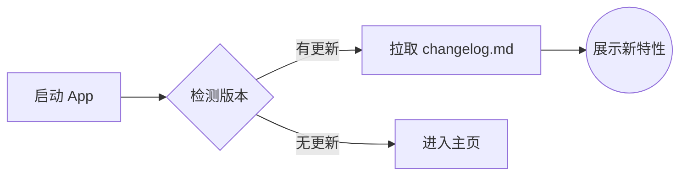

# 📢 更新日志

> 感谢您使用我们的 App！以下是最新版本的更新内容。

## 🚀 v0.1.1 `(Build 104802305)`

*此版本目前仅提供 **API23** 软件包。*

### ✨ 新功能 (New Features)

- **跨设备接续与遥控器模式**
  > 新增 HarmonyOS 跨端流转基础支持。阅读状态会在流转时写入分布式会话，目标设备可恢复到对应书籍、章节和进度。
  - 流转成功后可选择进入“遥控器模式”，远程控制目标设备上一页、下一页、上一章、下一章和自动阅读。
  - 漫画与小说阅读器已接入实时进度同步和远程指令监听。
  - 新增分布式文件缓存与代理下载服务的基础框架，为后续离线/跨设备阅读联动做准备。

- **Markdown 电子书阅读支持**
  > Markdown 文件现在会作为独立电子书格式进入专用 Markdown 阅读引擎，不再误走普通 TXT 或 Reader Kit 链路。
  - 支持章节识别、目录跳转、阅读进度保存与恢复。
  - 支持字体、字号、字重、行高、页边距、字距、段距、首行缩进、对齐方式和主题同步。
  - 支持点击翻页、滚动进度快照、按阅读模式跨页/跨章节切换。

- **全新内置使用手册**
  > 使用手册已迁移为 `rawfile/user_manual.md` 中的 Markdown 电子书，覆盖书库、导入、阅读器、图源、书源、远程书库、下载、RSS、设置、备份和常见问题。
  - 手册会按 Markdown 标题自动生成章节目录。
  - 手册内目录链接使用应用内部跳转地址，不会打开外部网页。
  - 旧版手册记录会自动清理；当数据库中缺失新版手册时，会从 rawfile 重新恢复。

- **Markdown 进阶渲染**
  > 应用内 Markdown 渲染能力新增数学公式、脚注弹层与 Mermaid 图表支持。
  - 新增 KaTeX、脚注、Mermaid 及字体等本地渲染资源，减少复杂文档对网络资源的依赖。
  - 脚注支持以弹出层方式查看，更适合小屏阅读。
  - Markdown 预览组件新增内容、主题、阅读样式热更新，以及点击区域和进度变化回调。

- **传书与 Deep Link 云端信令**
  > 新增 `manxia.top` Cloudflare Worker 工程，用于 App Linking、Deep Link 跳转页和传书房间码 / WebSocket 信令控制面。
  - 支持创建、查询、关闭传书房间，并提供 Host / Peer WebSocket 信令地址。
  - 提供 `/transfer` 浏览器端测试面板，便于验证房间状态广播和心跳消息。
  - Worker 只承载控制消息，不传输文件数据。

- **公开版权电子书扩展**
  > 新增 Project Gutenberg 电子书扩展配置，用于免登录测试完整电子书下载到本地阅读链路。
  - 支持热门列表、搜索、详情、格式列表和最终文件链接提取。
  - 支持 EPUB、TXT、MOBI 等常见公开版权电子书格式。

### 🛠 优化与修复 (Improvements & Fixes)

- **跨设备接续与遥控器优化**：遥控器页面新增连接状态实时展示（连接中、在线、离线、异常）与指令拦截；阅读页新增“被遥控中”沉浸式状态悬浮窗；优化接续阅读成功后的 Toast 提示与分布式状态回调管理。
- **详情页加载体验优化**：统一详情页在章节加载过程中自动将操作按钮置为繁忙状态，避免操作冲突，并优化了章节列表的条件渲染逻辑。
- **主页书架显示优化**：主页新增“从顶部开始显示”网格选项以及底部栏圆角裁剪。
- **阅读设置保存优化**：漫画、小说、电子书和 WebView EPUB 阅读器的设置保存改为防抖写入，减少连续调节时的卡顿和重复数据库写入。
- **阅读器状态刷新优化**：多处阅读设置变更会立即克隆并刷新当前状态，改善设置面板点击后 UI 不更新的问题。
- **压缩包解压优化**：RAR、7Z、TAR、GZ、BZ2、XZ 等格式统一收敛到 `oh7zip` 处理，并补充 `tar.gz` 二次解压与临时文件清理逻辑。
- **依赖体积整理**：移除 `commons-compress` 与 `unrar` 依赖，锁文件同步精简；新增 HAP 内容体积分析脚本，便于排查包体组成。
- **Z-Library 扩展修复**：优化搜索、详情、封面、下载链接和格式列表提取逻辑，支持镜像站点 baseUrl 拼接与首选格式排序。
- **TSTRS 扩展修复**：来源从“用不了”恢复为可用状态，升级到 `1.2.0`，更新分类入口、下载源识别、推荐源跳转和最终文件列表提取。
- **扩展仓库索引更新**：扩展索引新增 Project Gutenberg，并同步 TSTRS 版本信息。
- **帮助与更新日志面板优化**：内容面板高度提升，新增字体大小弹窗，并使用阅读器样式同步 Markdown 内容背景与文字颜色。
- **在线来源页面优化**：图源详情页、统一详情页和漫画详情页会为标题包含汉化/翻译关键字的作品显示“汉化”标识。
- **列表与安全区修复**：图源/书源管理列表增加间距；小说字典、替换净化和 TXT 目录规则页面修正底部安全区；RSS 分组按钮改为文本样式，减少控件显示异常。
- **小说设置入口修复**：小说设置中的“阅读设置”入口改为进入阅读设置子页。
- **支持者名单更新**：新增近期支持者信息。

### 🚧 已知问题与优化计划 (Known Issues)

部分功能目前仍在积极完善中，为您带来的不便敬请谅解：
- [ ] 🔄 **跨设备接续与遥控器**：基础链路已接入，但多设备权限、网络状态和真机一致性仍需继续打磨
- [ ] 🎧 **听书功能**：基础功能可用，但高阶体验仍需打磨
- [ ] 📚 **Suwayomi 兼容**：功能支持尚未完全对齐
- [ ] 📖 **Komga 兼容**：部分特性解析存在异常
- [ ] 🔄 **备份与恢复**：存在若干边缘测试未通过的问题，将在后续版本重点修复

---

## 🧪 Markdown 进阶渲染演示 (Tech Preview)

为了更好地在应用内展示复杂内容，我们在本次更新后为 Markdown 引擎注入了更多强大的特性！[^1]

### 1. 数学公式 (KaTeX)

支持行内公式如质能方程 $E = mc^2$，也支持复杂的块级排版：

$$
\mathcal{L} = \bar{\psi} (i \gamma^\mu \partial_\mu - m) \psi - \frac{1}{4} F_{\mu\nu} F^{\mu\nu}
$$

### 2. 流程图谱 (Mermaid)

[^1]: 这里是**脚注**的演示。得益于本次更新的 `marked-footnote` 插件，我们现在可以用更严谨的方式撰写文档与注脚。
